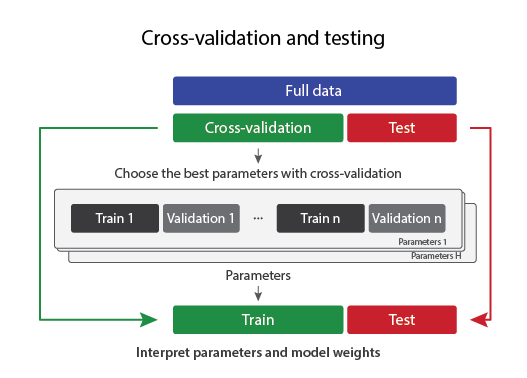
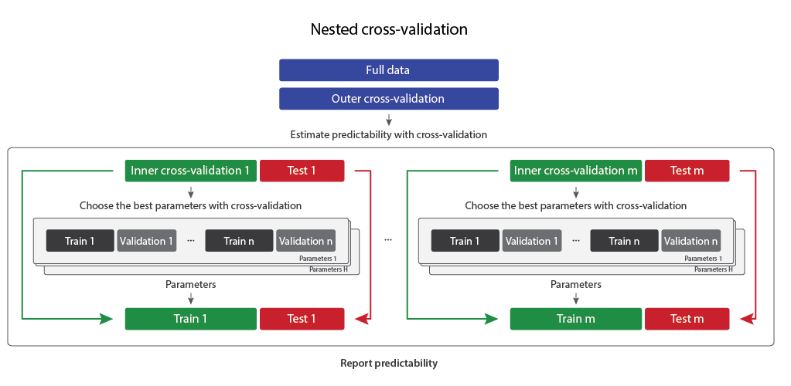
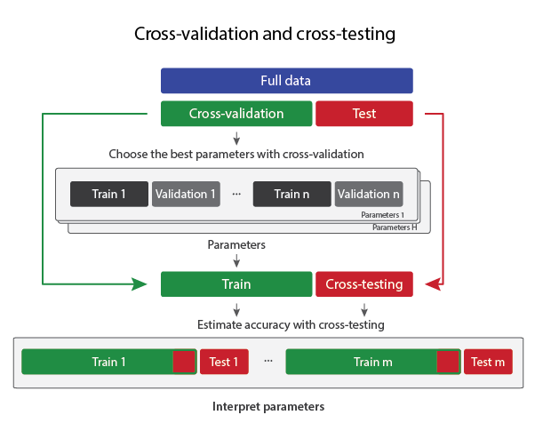

# Supporting Information for an article "An efficient data partitioning to improve classification performance while keeping parameters interpretable" submitted to PLOS ONE.

Authors: Kristjan Korjus (korjus@gmail.com), Martin Hebart and Raul Vicente

Abstract: Supervised machine learning methods typically require splitting data into multiple chunks for training, validating, and finally testing classifiers. For finding the best parameters of a classifier, training and validation are usually carried out with cross-validation. This is followed by application of the classifier with optimized parameters to a separate test set for estimating the classifier’s generalization performance. With limited data, this separation of test data creates a difficult trade-off between having more statistical power in estimating generalization performance versus choosing better parameters and fitting a better model. We propose a novel approach that we term “Cross-validation and cross-testing” improving this trade-off by re-using test data without biasing classifier performance. The novel approach is validated using simulated data and electrophysiological recordings in humans and rodents. The results demonstrate that the approach has a higher probability of discovering significant results than the standard approach of cross-validation and testing, while maintaining the nominal alpha level. In contrast to nested cross-validation, which is maximally efficient in re-using data, the proposed approach additionally maintains the interpretability of individual parameters. Taken together, we suggest an addition to currently used machine learning approaches which may be particularly useful in cases where model weights do not require interpretation, but parameters do.

## Figures of three approaches
Source file: `graphs/approaches.ai`

## The code

* For the article, a bash script `run_all.sh` was used in the server with SLURM support and then three scripts in folder `src_r/` were used to generate figures seen in the Results section of the paper.
* It is possible to understand the general structure of the experiments from the files `src_matlab/main.m` and `src_matlab/main2_fix_x.m`.
* Three approaches are defined in files `src_matlab/pipeline1.m`, `src_matlab/pipeline2.m` and `src_matlab/pipeline3.m`.
* We also made an example script that computes two runs for simulated data and plots a figure: `src_matlab/test_run.m`
* LIBSVM is used in the current work. If it does not work out-of-the-box it can be downloaded from here: https://www.csie.ntu.edu.tw/~cjlin/libsvm/
